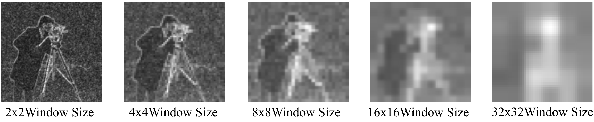
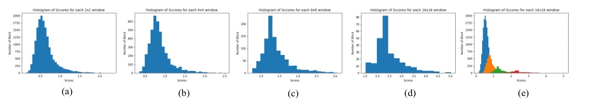
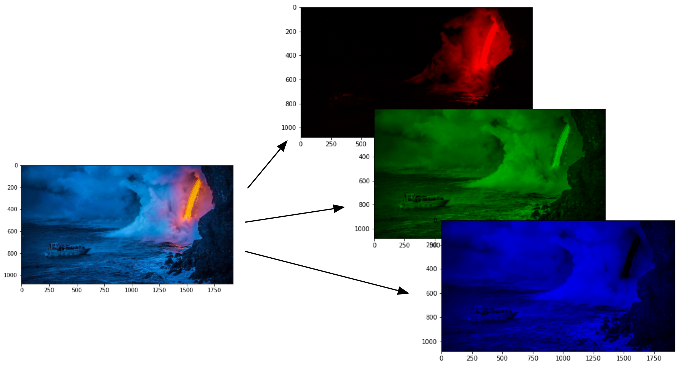
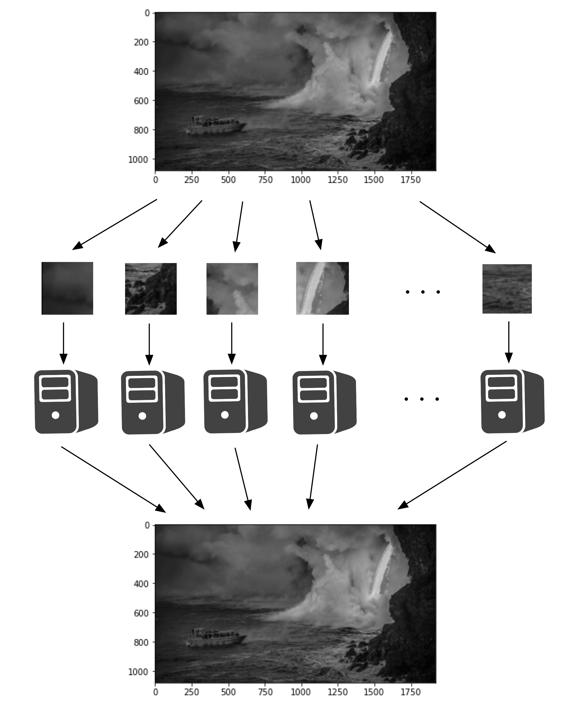
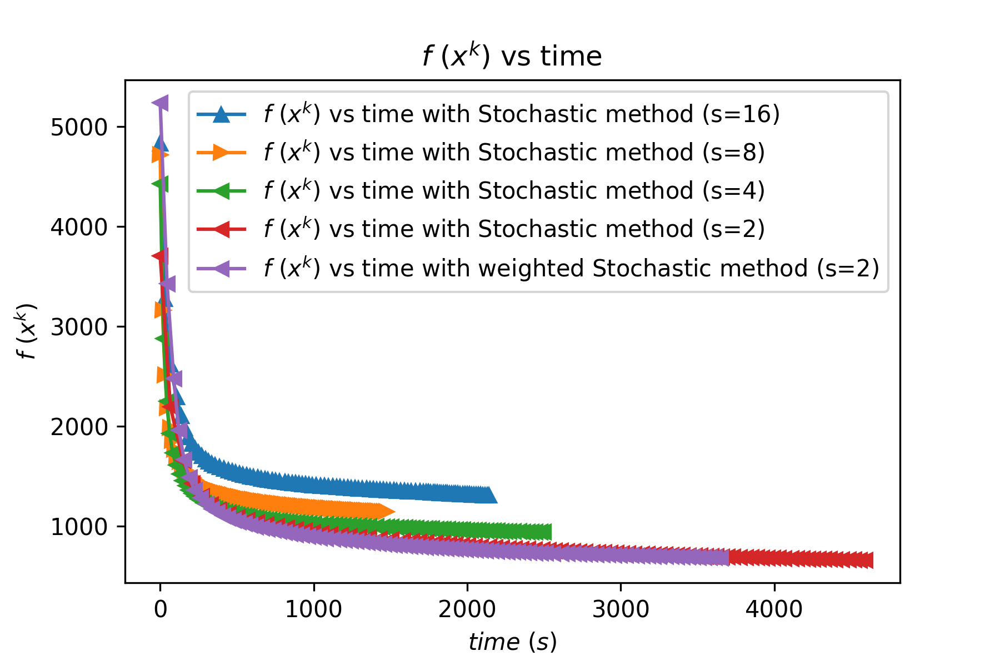
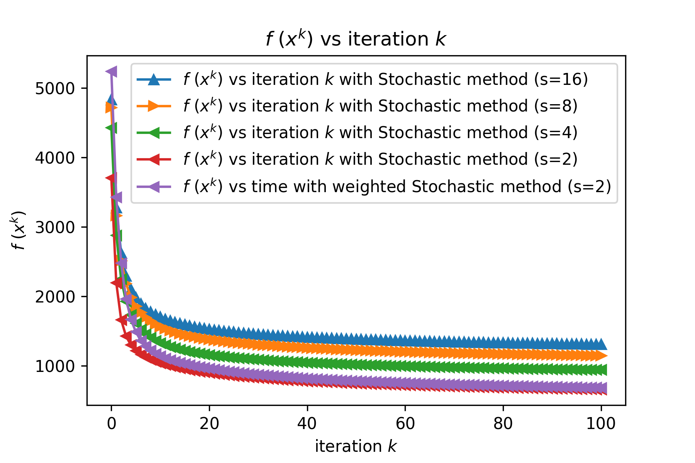

#Final Report Additional Part

---

## 新增部分：

## Large scale problem

Stochastic methode 能够做到显著加速降噪算法的作用，这也就使得大规模问题的解决成为了可能。但是这种方法任然需要耗时超过10秒钟来处理一张256x256的单色小照片，这是在实际应用中不能接受的。因此我们需要一种更加快速的降噪方法。

在实践中，我们发现对于stochastic method，不同的window的初始score都不一样，而且可以通过window初始score来判断这个window中的点的差异程度。为了让这个理论简单易懂，according to figure \ref{img21}, it can be found that for window sizes are 2x2, 4x4, 8x8, 16x16, 32x32, the place where is whiter is always the same place. 

于是我们可以根据方格颜色，来进行权重排序。颜色浅的方块意味着高权重。高权重者在denois的时候多进行几次运算，低权重者少几次运算。为了达到这个目的，random sampling方法被选取，来sample需要进行denois的方块。

Stochastic method can significantly accelerate the denoising algorithm, which makes it possible to solve large-scale problems. But this method still takes more than 10 seconds to process a small 256x256 monochrome photo, which is unacceptable in practical applications. Therefore, we need a faster denoising method.

In practice, we found that for the stochastic method, the initial score of different windows is different, and the degree of difference of the points in the window can be judged by the initial score of the window. In order to make this theory simple and easy to understand, according to figure \ref{img21}, it can be found that for window sizes are 2x2, 4x4, 8x8, 16x16, 32x32, the place where is whiter is always the same place.

So we can sort the weights according to the color of the grid. A light-colored square means high weight. Those with high weight perform a few more operations when denois, and those with low weight do less operations. In order to achieve this goal, the random sampling method is selected, and the denois block is required to sample.



[img] Figure 21. the scored figure of the “Camera Man” with different window size. (From left to right, the window sizes are 2x2, 4x4, 8x8, 16x16, 32x32)


---

权重计算方法被展示如下。首先统计被进行，统计结果见柱状图（Figure \ref{img22}). 通过观察figure \ref{img22}(a), (b), (c) and (d)，可以发现方块的score的分布是个近似的正态分布。分数集中在中间区域，因此对于score较高的方块数量比较少。对于这些score很高的方块进行denoising的收益会比对score比较低的方块进行denoising的收益更大。

The weight calculation method is shown below. First, the statistics are performed, and the statistical results are shown in the histogram (Figure \ref{img22}). By observing the figure \ref{img22}(a), (b), (c) and (d), you can find the score distribution of the square. It is an approximately normal distribution. The score is concentrated in the middle area, so the number of squares with a higher score is relatively small. The benefits of denoising these blocks with high scores will be greater than the benefits of denoising blocks with lower scores.



[img] Figure 22. the score distribution of one figure with different window size (From (a) to (d), the window sizes are 2x2, 4x4, 8x8, 16x16, 32x32) and the plot on one single graph (e).

通过观察figure \ref{img22}(d), 可以发现window size越大，score就会越高。因此一个函数被需要从而将柱状图修正一下，让score高的别太高，低的别太低。最后按照权重采样后进行denoising计算。还是运行方块总数为图片方块总数定为1个iteration。

根据分数的随机采样算法如下。

By observing the figure \ref{img22}(d), it can be found that the larger the window size, the higher the score. Therefore, a function is needed to correct the histogram so that the score is not too high for the high score and not too low for the low score. Finally, perform denoising calculation after sampling according to weight. Or the total number of running squares is the total number of image squares set as 1 iteration.

The random sampling algorithm based on the score is as follows.

```python
def getProbArray(x, f, fun, lambda_, side):
    weight = getWeightTable(x, f, fun, lambda_, side)
    max_w = weight.max()
    min_w = weight.min()
    hist_data = np.array(weight)
    hist_data=(hist_data+hist_data.mean())
    hist_data=hist_data/hist_data.sum()
    prob_list = []
    pos_list = []
    for i in range(hist_data.shape[0]):
        for j in range(hist_data.shape[1]):
            pos_list.append([i,j])
            prob_list.append(hist_data[i,j])
    return pos_list, prob_list
  
  def randomChoise(pos_list, prob_list):
    p = np.array(prob_list)
    index = np.random.choice(list(range(len(prob_list))), p = p.ravel())
    return pos_list[index]
```


---


---

## Parallel Computing

对于大规模问题，并行计算是提升速度的好方法。对于大图我们首先需要进行图片颜色拆分，如 figure \ref{img23} 所示，将彩色图片根据红绿蓝三色图层分层，可以得到三张单色图片。但是这些单色图片任然是很大的，因此需要并行计算来提升速度。

对于大规模需要分布式计算。而并行计算可以简单定义为**同时利用多个计算资源解决一个计算问题**。因为我们使用了stochastic method，所以denoising问题可以被分解成离散可并发解决的小部分。通过将大图切割成多个等大小的window，然后将这些windows分组到不同的计算机核心中进行计算。这样的结果是每一部分的指令在不同的CPU上同时执行。

For large-scale problems, parallel computing is a good way to increase speed. For large images, we first need to split the color of the image. As shown in figure \ref{img23}, layer the color image according to the red, green and blue layers to get three monochrome images. But these monochrome pictures are still very large, so parallel computing is needed to increase the speed.

For large-scale problems, distributed computing is required. Parallel computing can be simply defined as using multiple computing resources to solve a computing problem at the same time. Because we use the stochastic method, the denoising problem can be broken down into discrete and concurrently solvable parts. By cutting the big picture into multiple windows of equal size, and then grouping these windows into different computer cores for calculation. The result is that each part of the instructions are executed simultaneously on different CPUs.

> My computer is MacBook Pro 2015 (2 Cores, 2.7 GHz). Becauase there is only 2 cores, we can only use 2 process to do parallel computing.

因此我的python程序将图片所产生的windows分为两组，分别交给两个系统核心进行python并行计算。将图片分块后，windows被按照高低强弱分组，尽量平分为score总数相等的两组，然后两组在不同的计算及核心上分别计算，每轮计算完成合并一次。对于有多台计算机或者计算机有多核心的情况可以得到更快的速度，figure \ref{img24} 显示了多核心时候的加速方法。

Therefore, my python program divides the windows generated by the picture into two groups, and hands them to the two system cores for python parallel calculation. After the picture is divided into blocks, the windows are grouped according to high and low strength, and try to divide them into two groups with the same total score as much as possible. Then the two groups are calculated separately on different calculations and cores, and each round of calculation is completed and merged. For multiple computers or computers with multiple cores, you can get faster speeds. Figure \ref{img24} shows the acceleration method when multiple cores are used.



[img] Figure 23. Layer the color pictures according to the RGB layers to get three monochrome pictures




[img] Figure 24. Schematic diagram of parallel calculation of denoising algorithm accelerated by weighted stochastic method.

然后对于运算结果，要和我们之前的运算对比

First, the $f(x^{k})$ vs. time and  $f(x^{k})$ vs. iteration k are presented to show the speed of convergence, in figure \ref{img25} and figure \ref{img26}, compared with the general gradient descent, gradient descent accelerated by the Nesterov method, gradient descent accelerated by the Stochastic method. Figure \ref{img25} shows that the total time of parallel calculation will be faster than single-core calculation, but comparing figure \ref{img26}, it can be found that there is no significant improvement in $f(x^{k})$ vs. iteration $k$. This is normal, because parallel computing does not reduce the amount of calculation required, but only reduces the required calculation time. However, it is found in figure \ref{img25} that the time reduction of parallel computing is not as normal, only about a quarter of the original. This is because a single host is performing parallel computing while also having other computing tasks. So the final conclusion is that parallel computing can indeed reduce the total calculation time required.



[img25]
Comparision of $f(x^{k})$ vs. time for gradient descent, gradient descent accelerated by the Nesterov method, gradient descent accelerated by the Stochastic method, and gradient descent accelerated by the weighted Stochastic method.



[img26]
Comparision of $f(x^{k})$ vs. time for gradient descent, gradient descent accelerated by the Nesterov method, gradient descent accelerated by the Stochastic method, and gradient descent accelerated by the weighted Stochastic method.


## Conclusion

在本project中，多种算法被应用到图片denoising领域。从最简单的geadient descent, 到各种gradient descent的加速算法，比如Nesterov 和 stochastic加速算法。最后并行计算被尝试用于加速运算速度。通过这些算法实操，优化算法的重要性被理解。这个project帮助了我更加深入的理解优化算法和其实际应用。

本project的代码都是基于python3.6的，并且可以在更高版本的python上运行。运行环境是MacOS，并且经测试，可以在linux上达到一样的效果。但是某些并行计算部分的代码在windows上无法运行。所有代码都是在Jupyter Lab 的平台上进行开发的，这样可以实时可视化编辑，节省时间。

最后十分感谢黄教授的授课和答疑以及各位TA的帮助！

In this project, a variety of algorithms are applied to the field of image denoising. From the simplest gradient descent to various gradient descent acceleration algorithms, such as Nesterov and stochastic acceleration algorithms. Finally, parallel computing was tried to speed up the computing speed. Through these algorithms, the importance of optimization algorithms is understood. This project helped me understand the optimization algorithm and its practical application more deeply.

The code of this project is based on python3.6 and can run on higher versions of python. The operating environment is MacOS, and after testing, the same effect can be achieved on Linux. However, some parallel computing part of the code cannot run on windows. All codes are developed on the Jupyter Lab platform, which can be visually edited in real-time and save time.

Finally, I would like to appreciate Professor Huang for teaching the wonderful class and answering my questions, and thanks all TAs for their help!


