# HW5

> Bingcheng Hu 胡炳城
> 516021910219

## Total Variance in Image denoising

In this section, the complete derivation process of the image denoising algorithm will be introduced. To make the start simpler to understand, we choose the general gradient descent (GD) algorithm as the first step of denoising.

As stated in the previous section, our aim is to

$$
\min _{X} \lambda\|X\|_{T V}+\|F-X\|_{2}^{2}.
$$

According to the gradient descent algorithm, the problem can be solved with the following procedures:

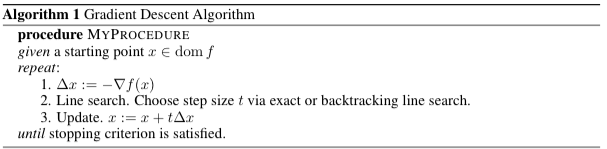

So it's needed to compute $\Delta x:=-\nabla f(x)$ every step, then we need to do exact line search in the direction of the negative side of the gradient.

## Calculate the gradient of the aim function

In this section, the procedure of calculating the partial differentiation. Both of the following two items will be partially differentiated separately.

$$
\|X\|_{T V}=\sum_{i=1}^{n-1} \sum_{j=1}^{n-1} \sqrt{\left(X_{i, j}-X_{i+1, j}\right)^{2}+\left(X_{i, j}-X_{i, j+1}\right)^{2}}\
$$


$$
dissimilarity = \|F-X\|_{2}^{2}
$$


In the following subsections, the full procedures will be implemented.

### Calculate the partial differentiation of $\|X\|_{T V}$


The condition of the related blocks is shown in figure \ref{img5}. According to the differential equation of the equation of TV, for every $x_{i,j}$, there will be three part of equations connected with it, and they are
$$
\sqrt{\left(X_{i, j}-X_{i+1, j}\right)^{2}+\left(X_{i, j}-X_{i, j+1}\right)^{2}},\ \\
\sqrt{\left(X_{i-1, j}-X_{i, j}\right)^{2}+\left(X_{i-1, j}-X_{i-1, j+1}\right)^{2}},\ \\
\sqrt{\left(X_{i, j-1}-X_{i+1, j-1}\right)^{2}+\left(X_{i, j-1}-X_{i, j}\right)^{2}},\
$$


and as you can see, there will be three inverse “L” shape block hit the center block for every $x_{i,j}$, and each of them is colored with blue, green, and red.


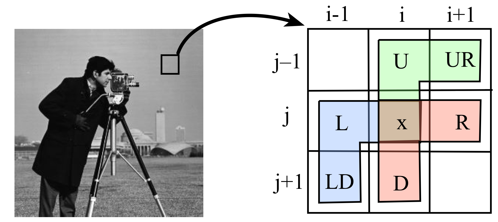

Figure 5. the representation of one center pixel surrounded by eight pixels.

By looking at the three equations connedted with $x_{i,j}$, it can be found that they can be seperated to to part, $\sqrt{(x-a)^{2}+(x-b)^{2}}$ and $\sqrt{(a-x)^{2}+(a-b)^{2}}$. To Calculate $\frac{\partial}{\partial x}\|X\|_{T V}$, the partial diffrenciation of these two equation should be calculated first.


$$
\frac{\partial}{\partial x}(\sqrt{(x-a)^{2}+(x-b)^{2}})= 
\frac{-a-b+2 x}{\sqrt{a^{2}-2 a x+b^{2}-2 b x+2 x^{2}}}
$$

$$
\frac{\partial}{\partial x}(\sqrt{(a-x)^{2}+(a-b)^{2}})=-\frac{a-x}{\sqrt{(a-b)^{2}+(a-x)^{2}}}
$$

The Python implecation of these equations are shown below:

```python
def delTV(L, R, U, D, LD, UR, x):
    def delTV1(a,b,x):
        divider = a*a - 2*a*x + b*b - 2*b*x + 2*x*x
        return (-a-b+2*x)/math.sqrt(divider) if divider>0 else 0
    def delTV2(a,b,x):
        divider = math.sqrt((a-b)*(a-b)+(a-x)*(a-x))
        return (-a+x)/divider if divider>0 else 0
    return delTV1(D, R, x) + delTV2(L,LD,x) + delTV2(U,UR,x)
```

### Calculate the partial differentiation of $\|F-X\|_{2}^{2}$

For this part, it can be solved easily.

$$
\frac{\partial}{\partial x}\left((a-x)^{2}\right)=2 x-2 a
$$


### Deal with the boundary condition

After implementing all the cells inside the image, there comes a problem that when meeting with the boundary, all these equations will lose some information as shown in figure \ref{img6}. For the shadow part, they are the missing message.


Figure 6. The boundary condition for the sample image which is hard to solve

It’s not easy to deal with this problem, and for the current state, ignoring the boundary pixels is one choice. This problem will be solved in future updates.

## Implement the Gradient Descent for Total Variation Denoising

In the folder of code, `GD_general.ipynb` and `GD_general.py` can be found (the content of them is the same). In the inner folder `img`, some original images can be seen, and they are downloaded from https://www.math.ust.hk/~masyleung/Teaching/CAS/MATLAB/image/target2.html. After running `GD_general.ipynb`, the output files are saved in the inner folder `gen-img`, and the example of the denoising processing are shown in figure \ref{img7}. The Noised images are generated with Gauss Noise (GN). The algorithm of Gauss Noise is in `img.py`.

```python
    def gaussNoise(im_array, sigma):
        im_array_flat = im_array.flatten()
        for i in range(im_array.shape[0]*im_array.shape[1]):
            pointInFlat = int(im_array_flat[i])+ random.gauss(0,sigma)
            if pointInFlat < 0:
                pointInFlat = 0
            if pointInFlat > 255:
                pointInFlat = 255
            im_array_flat[i] = pointInFlat
        im_array = im_array_flat.reshape([im_array.shape[0],im_array.shape[1]])
        return im_array
```

As shown in figure \ref{img7}, the leftmost one is the original image directly downloaded from the website, and the next one is the noised image. Then the following three images are the denoised image with iteration 1, 10, and 100. It can be found that after 10 iterations, the noised image is already much better than the first iteration.

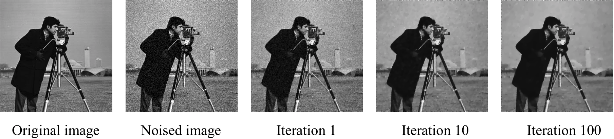

Figure 7. The original image, noised image, and three images are the denoised image with iteration 1, 10, and 100 with gradient descent.

To show the speed of convergence, $f(x^{k})$ vs. time and  $f(x^{k})$ vs. iteration k are shown in figure \ref{img8} and figure \ref{img9}. It can be found that at first iterations, the speed of convergence is fast. However, after some iterations, the speed is much slower.

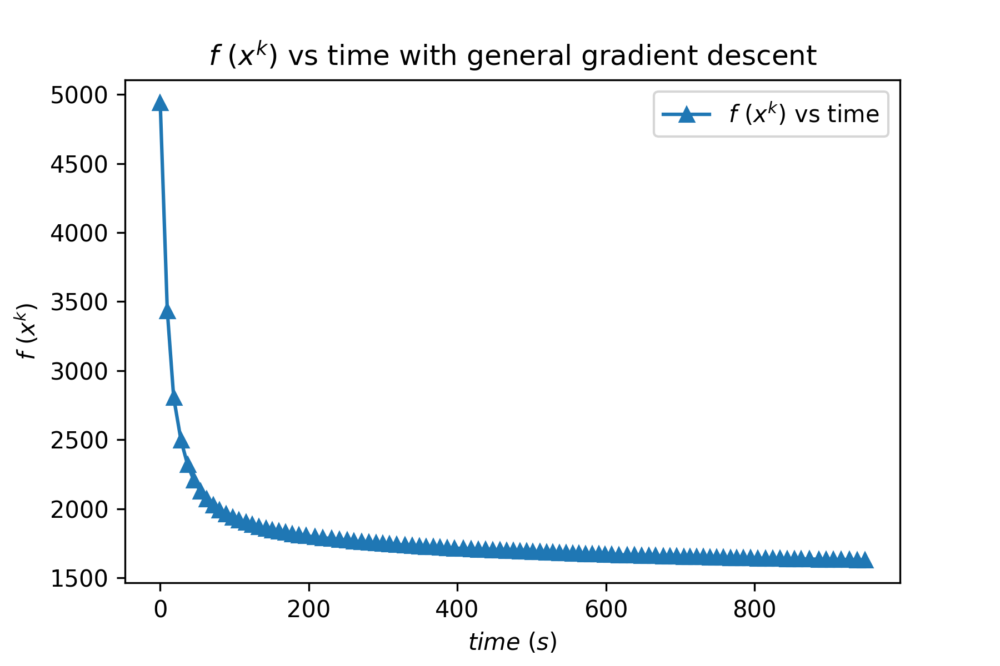

Figure 8. $f(x^{k})$ vs. time for general gradient discent.


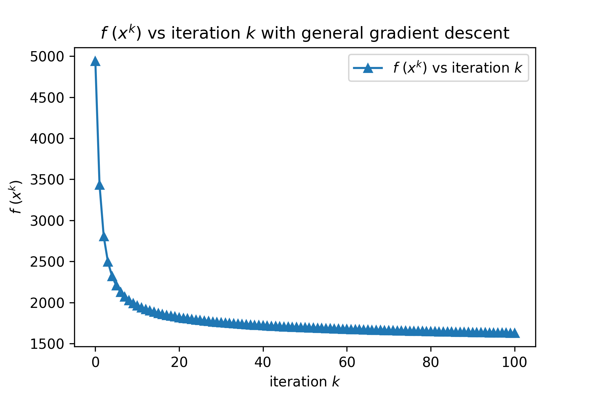

Figure 9. $f(x^{k})$ vs. iterration k for general gradient discent.


## Implement the Nesterov Acceleration to Accelerate Gradient Descent

To accelerate the speed of convergence, Nesterov acceleration is chosen as the speed-up algorithm. And the thinking of methods is shown below.

$$
\begin{array}{l}
z_{k+1}=x_{k}-t_{k} \nabla f\left(x_{k}\right) \\
x_{k+1}=z_{k+1}+\delta_{k}\left(z_{k+1}-z_{k}\right) \quad \delta_{k} \in[0,1)
\end{array}
$$

And the algorithm is shown below (Ioannis 2018).

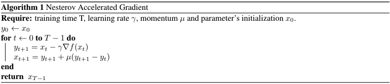

Ioannis (2018) also Compared Polyak’s method with Nesterov’s algorithm. Ioannis says that Polyak’s method evaluates the gradient before adding momentum, while Nesterov’s algorithm evaluates the gradient after applying momentum as shown in figure \ref{img10} (Ioannis 2018).

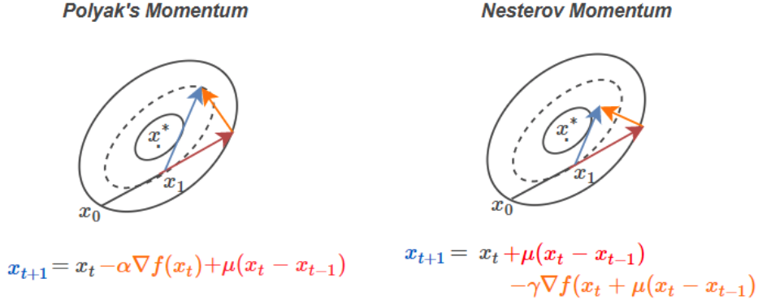

Figure 10. Comparison of Polyak’s method and Nesterov’s algorithm.

Just applying this method, the output is very similar to the pure exact gradient search (figure \ref{img11}). But the difference is not easy to be seen by human eyes. So the $f(x^{k})$ vs. time and  $f(x^{k})$ vs. iteration k are presented to show the speed of convergence, in figure \ref{img12} and figure \ref{img13}. It can be found that at first iterations, the speed of convergence is fast. However, after some iterations, the speed is much slower.


Figure 11. The original image, noised image, and three images are the denoised image with iteration 1, 10, and 100 with gradient descent accelerated by the Nesterov method.

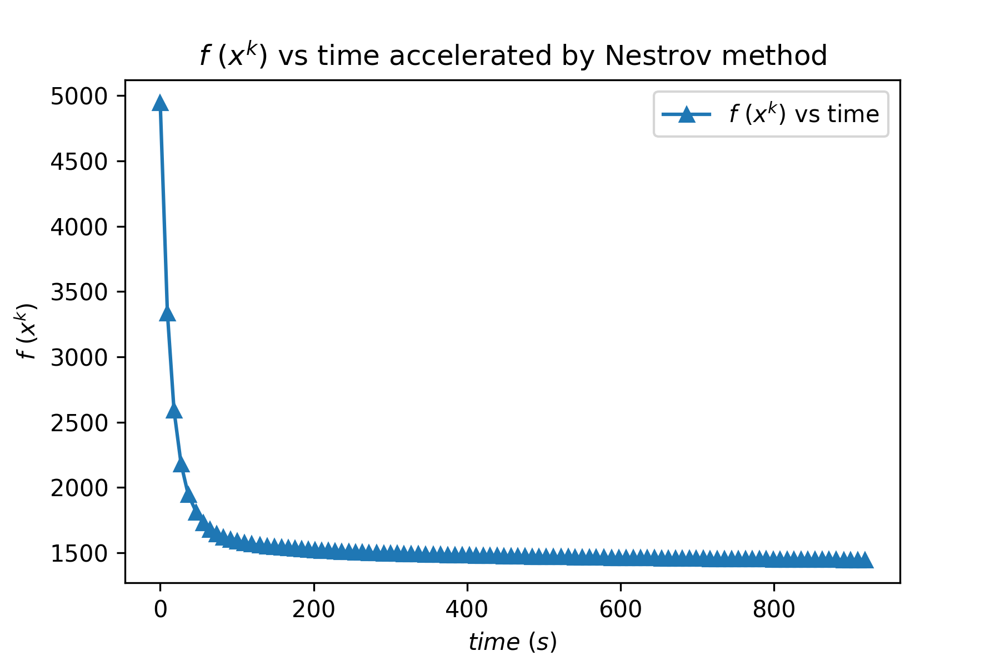

Figure 12. $f(x^{k})$ vs. time for gradient discent accelerated by Nestrov method.

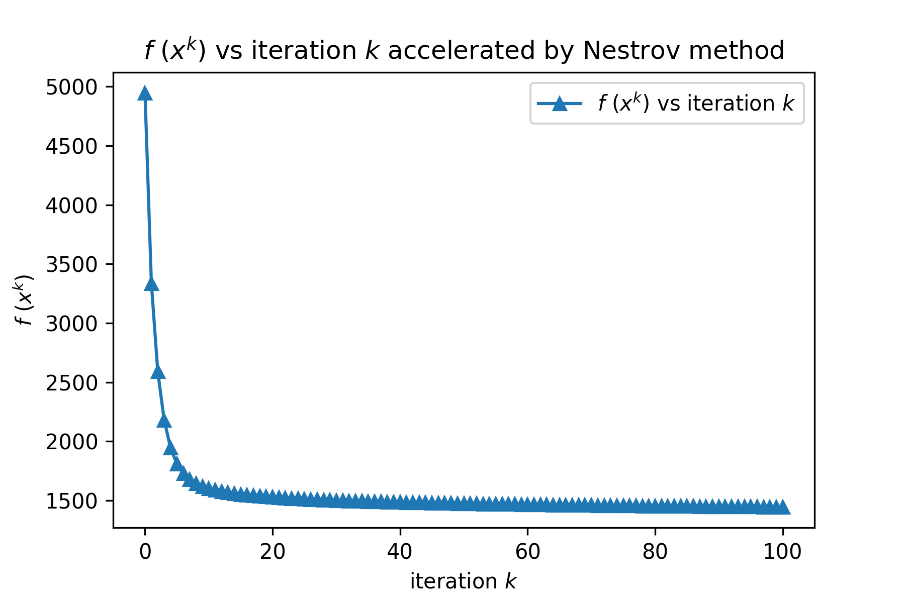

Figure 13. $f(x^{k})$ vs. iteration k for gradient discent accelerated by Nestrov method.


---


## Comparision of gradient descent and gradient descent accelerated by Nesterov method

Still, comparing those graphs in one figure is a better way to show the difference. Figure \ref{img14} shows the comparison of $f(x^{k})$ vs. time for gradient descent and gradient descent accelerated by Nesterov method. When accelerated by the Nesterov method, it only cost 82 seconds to reach the value that general gradient descent needs to cost 918 seconds to reach, which is 10 times faster! Comparing $f(x^{k})$ vs. iteration for gradient descent and gradient descent accelerated by Nesterov method as figure \ref{img15} present the same output: Nesterov method only cost 9 iterations to reach the value that general gradient descent need to cost 100 iterations to reach, which is also about 10 times faster! 

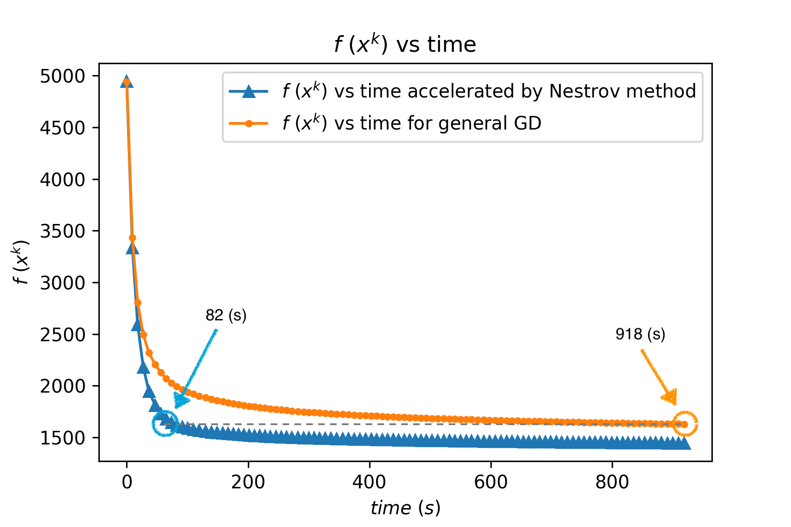

Figure 14. Comparision of $f(x^{k})$ vs. time for gradient descent and gradient descent accelerated by Nesterov method.


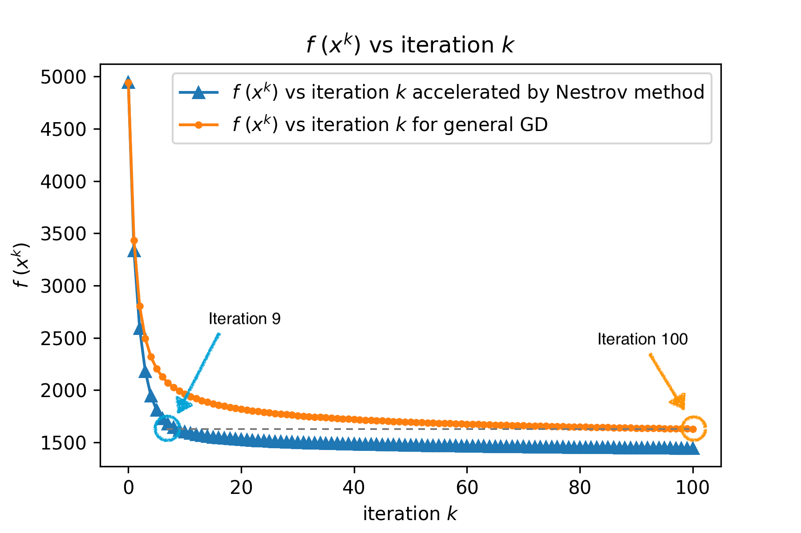

Figure 15. Comparision of $f(x^{k})$ vs. iteration k for gradient descent and gradient descent accelerated by Nesterov method.